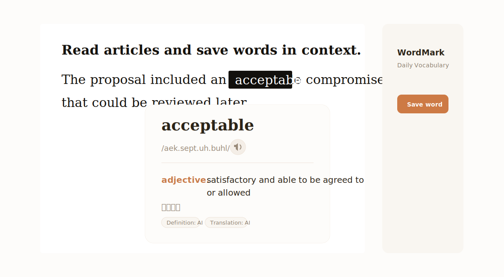
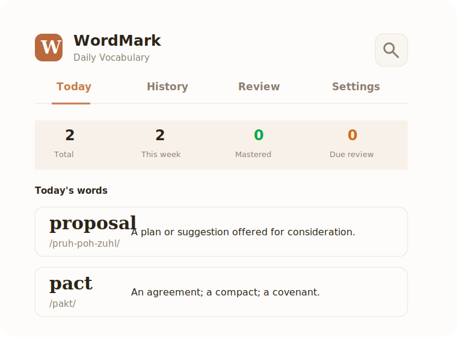
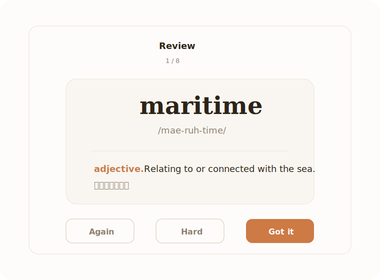
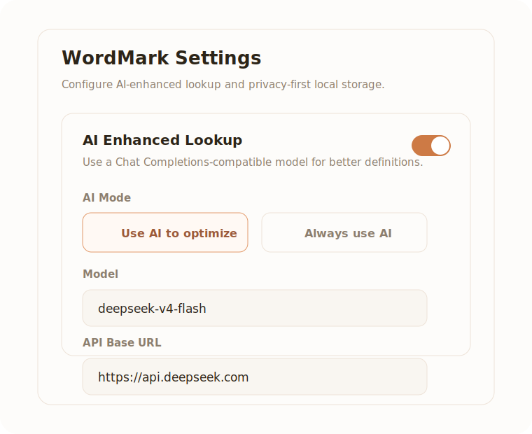

# WordMark - Daily Vocabulary Notebook

WordMark is a Chrome MV3 extension for capturing, organizing, and reviewing English vocabulary while reading web pages.

It is designed for learners who want to save words in context instead of copying them into a separate notebook later.



## What It Does

- Look up English words by double-clicking or selecting text on any web page.
- Save words with definitions, pronunciation, source URL, and the original context sentence.
- Review saved words with a spaced-repetition workflow.
- Browse today's words, history, tags, and mastered state.
- Highlight saved words when they appear again on web pages.
- Export/import vocabulary as JSON, CSV, or Anki text.
- Optional AI-enhanced lookup with any Chat Completions-compatible provider.

## Product Preview

| Vocabulary notebook | Review flow |
| --- | --- |
|  |  |

| AI lookup settings |
| --- |
|  |

## Manual Installation

WordMark is currently available for manual installation. A Chrome Web Store release is planned.

### 1. Download The Project

Clone the repository:

```bash
git clone https://github.com/JohnnyWang8802/wordmark-extension.git
cd wordmark-extension
```

Or download the repository ZIP from GitHub and unzip it locally.

### 2. Install Dependencies

```bash
npm install
```

### 3. Build The Extension

```bash
npm run build
```

This generates the Chrome extension package in the `dist/` directory.

### 4. Load It In Chrome

1. Open `chrome://extensions/`.
2. Enable **Developer mode**.
3. Click **Load unpacked**.
4. Select the generated `dist/` directory.
5. Pin WordMark from the Chrome extensions menu if you want quick access.

### 5. Start Using WordMark

Open any web article, then double-click an English word. WordMark will show a lookup bubble with definition, pronunciation, context, and a save button.

## AI-Enhanced Lookup

WordMark works without an AI API key. By default, it uses local dictionary lookup plus free translation fallback.

AI lookup is optional. If enabled, WordMark can use a compatible large model to improve missing or context-sensitive definitions.

Supported provider style:

```text
/v1/chat/completions compatible API
```

Common examples:

| Provider | API Base URL example |
| --- | --- |
| OpenAI | `https://api.openai.com/v1` |
| DeepSeek | `https://api.deepseek.com` |
| OpenRouter | `https://openrouter.ai/api/v1` |
| Kimi / Moonshot | `https://api.moonshot.cn/v1` |
| SiliconFlow | `https://api.siliconflow.cn/v1` |

### DeepSeek Example

To use the official DeepSeek API:

```text
Model: deepseek-v4-flash
API Base URL: https://api.deepseek.com
API Key: your DeepSeek API key
```

WordMark automatically sends requests to:

```text
https://api.deepseek.com/v1/chat/completions
```

## Privacy

- Saved words are stored in the user's local Chrome extension storage.
- The AI API key is stored locally and is not included in GitHub source code or exported backup files.
- WordMark does not operate its own backend server.
- Dictionary, translation, TTS, and optional AI requests are sent directly to the configured third-party providers.
- When AI lookup runs, the selected word and surrounding context sentence may be sent to the provider configured by the user.

## Development

Run the popup preview:

```bash
npm run dev
```

The dev server previews the popup UI at:

```text
http://localhost:5173/
```

Run quality checks:

```bash
npm test
npm run typecheck
npm run build
```

## Project Structure

```text
src/background/      Extension service worker
src/content/         Web page selection and lookup bubble
src/popup/           Popup and side-panel React UI
src/services/        Storage, dictionary, translation, AI lookup, networking
src/utils/           Date, i18n, lemmatizer, labels, helpers
tests/               Unit tests
```

## Notes

The extension uses third-party dictionary, translation, and TTS endpoints. Requests include timeout handling, temporary-failure caching, and rate limiting to avoid repeated failed calls.

